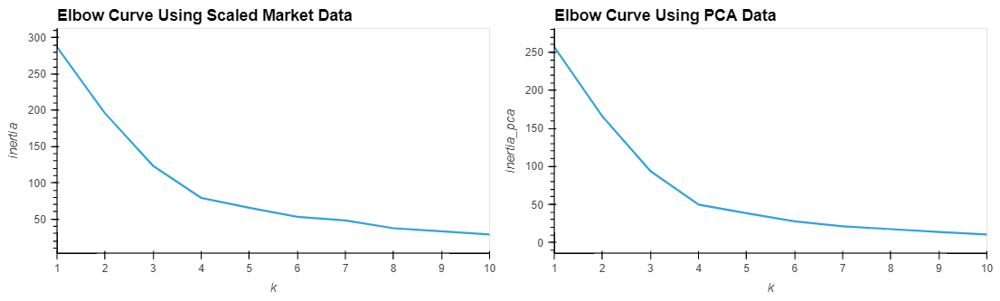
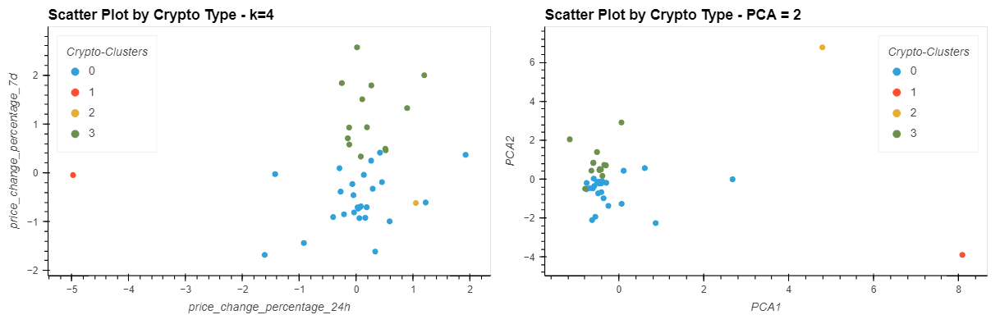

# Module 10 Challenge: Crypto Clustering

## Project

This challenge uses the python library from sklearn to inlude the packages KMeans, PCA, and StandardScalern for unsupervised learning of cryptocurrency price changes.

The project uses hvplot to show cryptocurrency performance in different time periods to show results.

The results were as follows.

---
